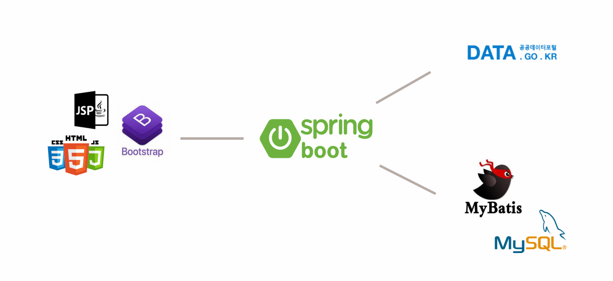
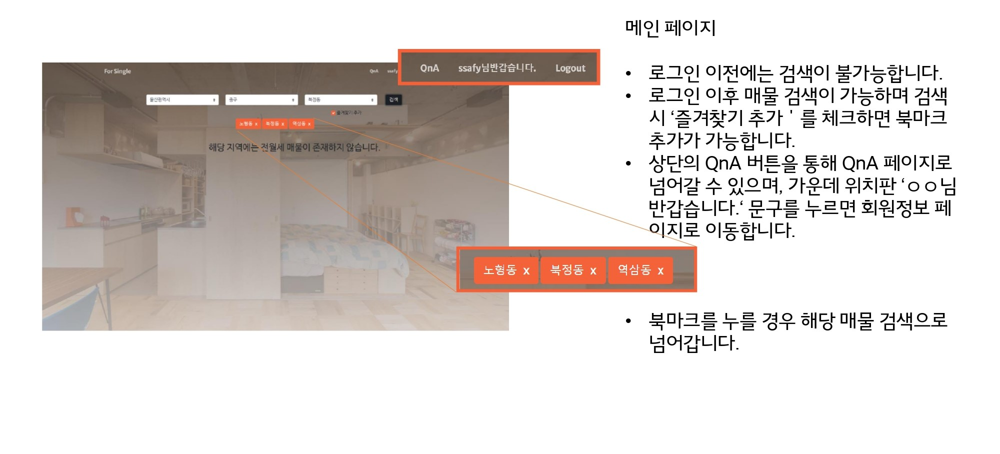
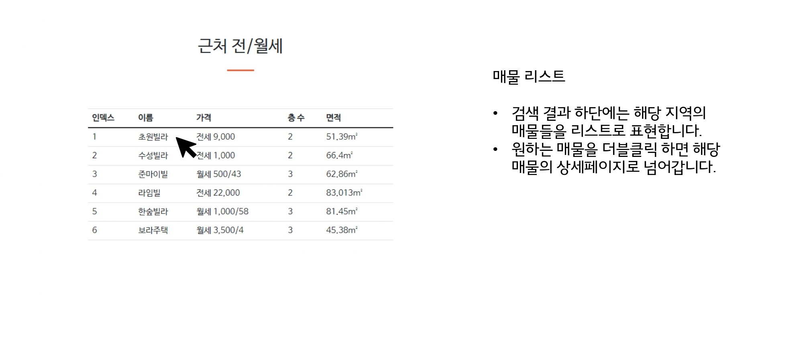
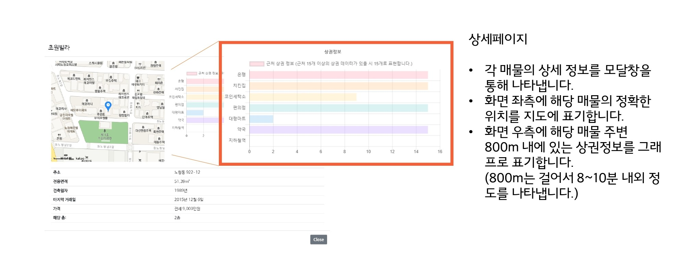
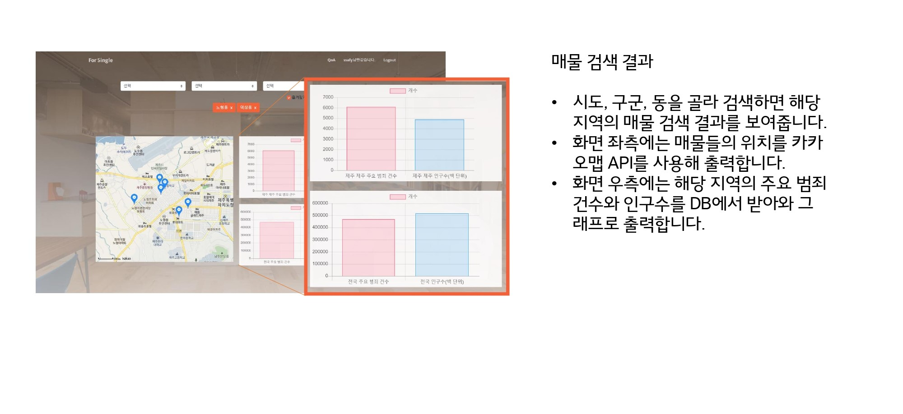
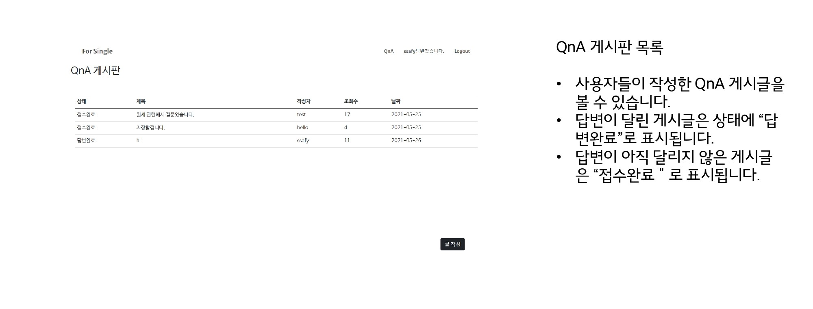
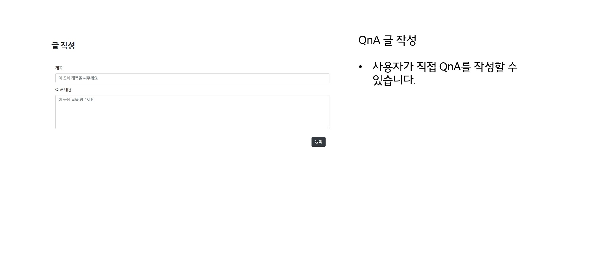
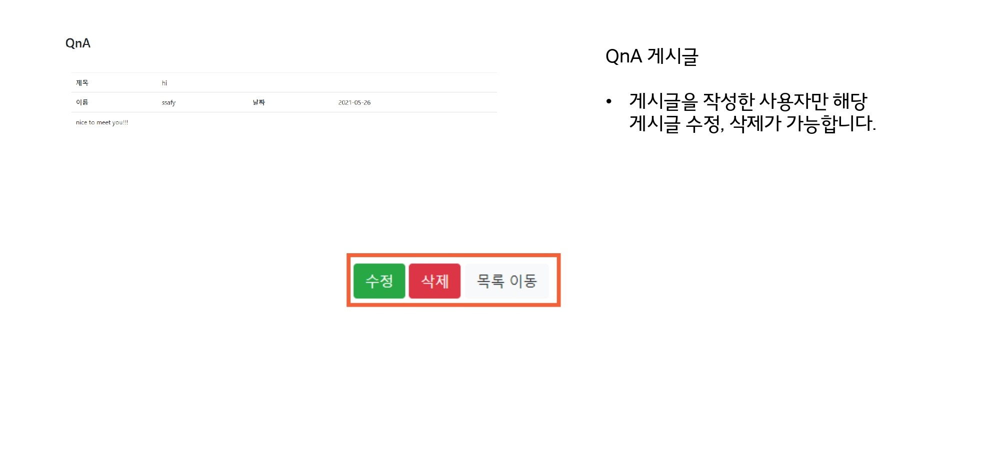
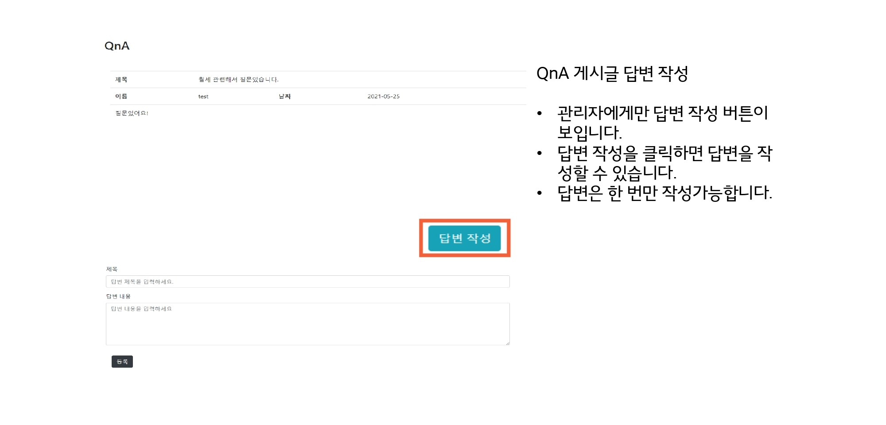

## HappyHouse

공공데이터와 카카오맵 API 등을 사용해 전월세 매물 뿐만 아니라 주변 상권 및 치안 관련 정보 제공 사이트

### 배경

대학생을 막 지나 사회인이 되는 20대에게 필요한 정보를 제공해주는 서비스를 만들고 싶다

### 목표

사는 곳도 중요하지만 주변 상권 정보와 안전까지 확인할 수 있어 최적의 매물을 찾을 수 있도록 도와줄 뿐만 아니라, 질문이 있을 경우 QnA 게시판에서 질문을 통해 궁금증을 해소할 수 있다.

### 역할분담

#### 박선아 

- 메인페이지 UI

- 매물 상세페이지 UI

- QnA 답변 CRUD

- 카카오맵 API 연동
- 상권정보 차트 UI

- 로그인/로그아웃

- 회원가입

#### 황정태

- 전월세 매물 및 범죄율 데이터 가공 

- 근처 상권정보 데이터 가공

- 메인페이지 CRUD

- 상세페이지 CRUD

- QnA 페이지 CRUD

- 범죄율 차트 UI

 

### 시스템 구조도
**frontend : JSP**

**backend : Spring mvc** 

**data : 공공데이터포털 - 국토교통부_연립다세대 전월세 자료 활용**

 

### 화면 흐름도

#### 전/월세 매물 찾기 메인페이지

 

#### 매물검색결과 

 

#### 매물리스트

 

#### 특정 매물 상세 페이지

 

 

#### QnA 목록

 

#### QnA 작성

 

#### QnA 수정 및 삭제

 

#### QnA 답변 작성

 

#### QnA 답변 수정 및 삭제

 

